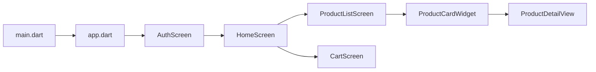
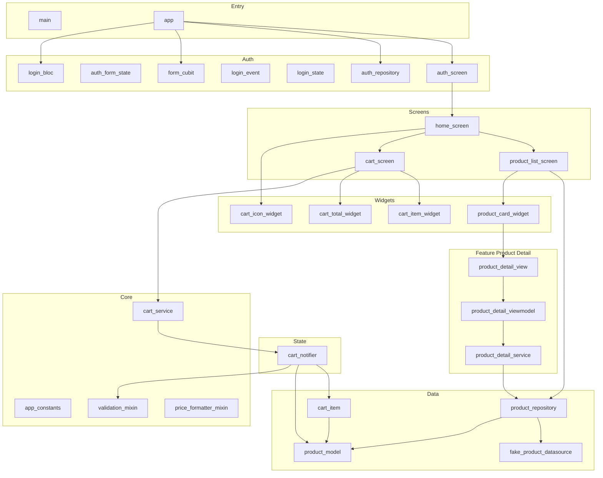

# Rà soát dự án ShopCartDemo – Danh sách file code theo thứ tự logic

Dự án là ứng dụng Flutter **Shopping Cart Demo**: đăng nhập/đăng ký (BLoC) → Home (danh sách sản phẩm + giỏ hàng, Riverpod). Clean Architecture nhẹ (data / domain / presentation) và feature `product_detail` (MVVM + Riverpod).

---

## 1. Luồng khởi chạy ứng dụng (thứ tự xuất hiện)

---

## 2. Danh sách file theo thứ tự logic

### Nhóm A – Điểm vào và cấu hình app

| #   | File                           | Vì sao có                 | Dùng để làm gì                                                                                                                                                      |
| --- | ------------------------------ | ------------------------- | ------------------------------------------------------------------------------------------------------------------------------------------------------------------- |
| 1   | [lib/main.dart](lib/main.dart) | Entry point chuẩn Flutter | `WidgetsFlutterBinding.ensureInitialized()`, `runApp(ProviderScope(child: MyApp()))` – bọc Riverpod cho toàn app.                                                   |
| 2   | [lib/app.dart](lib/app.dart)   | Cấu hình root widget      | `MultiBlocProvider` (FormCubit, LoginBloc), `MaterialApp` (theme, Google Fonts), `home: AuthScreen`. Không có route name; sau đăng nhập push replacement sang Home. |

---

### Nhóm B – Auth (BLoC + Cubit): phục vụ màn hình đăng nhập

| #   | File                                                                                               | Vì sao có                                            | Dùng để làm gì                                                                                                                            |
| --- | -------------------------------------------------------------------------------------------------- | ---------------------------------------------------- | ----------------------------------------------------------------------------------------------------------------------------------------- |
| 3   | [lib/data/repositories/auth_repository.dart](lib/data/repositories/auth_repository.dart)           | Tách logic “đăng nhập/đăng ký” khỏi UI               | Demo: `login`/`register` async, trả về true nếu email có `@` và password >= 6. Nơi sau này gắn API thật.                                  |
| 4   | [lib/presentation/auth/form/auth_form_state.dart](lib/presentation/auth/form/auth_form_state.dart) | State cho form (tránh trùng `FormState` của Flutter) | Immutable state: email, password, emailError, passwordError; `copyWith`, getter `isValid` cho nút bấm.                                    |
| 5   | [lib/presentation/auth/form/form_cubit.dart](lib/presentation/auth/form/form_cubit.dart)           | Quản lý state form theo từng thay đổi                | Cubit: `emailChanged`, `passwordChanged` (validate + emit AuthFormState), `reset`.                                                        |
| 6   | [lib/presentation/auth/login/login_event.dart](lib/presentation/auth/login/login_event.dart)       | Định nghĩa event cho Login BLoC                      | Sealed class: `LoginRequested(email, password)`, `RegisterRequested(email, password)`.                                                    |
| 7   | [lib/presentation/auth/login/login_state.dart](lib/presentation/auth/login/login_state.dart)       | Định nghĩa state cho Login BLoC                      | Sealed: `LoginInitial`, `LoginLoading`, `LoginSuccess`, `LoginFailure(message)`.                                                          |
| 8   | [lib/presentation/auth/login/login_bloc.dart](lib/presentation/auth/login/login_bloc.dart)         | Xử lý đăng nhập/đăng ký                              | Nhận event → emit Loading → gọi AuthRepository → Success hoặc Failure. Được tạo trong app.dart với AuthRepository.                        |
| 9   | [lib/presentation/auth/auth_screen.dart](lib/presentation/auth/auth_screen.dart)                   | Màn hình đầu tiên khi mở app                         | Tab Đăng nhập/Đăng ký, form email/password (BlocBuilder FormCubit), nút gửi (LoginBloc). LoginSuccess → `pushReplacement` tới HomeScreen. |

---

### Nhóm C – Core: hằng số, mixin, service dùng chung

| #   | File                                                                                     | Vì sao có                         | Dùng để làm gì                                                                                                                        |
| --- | ---------------------------------------------------------------------------------------- | --------------------------------- | ------------------------------------------------------------------------------------------------------------------------------------- |
| 10  | [lib/core/constants/app_constants.dart](lib/core/constants/app_constants.dart)           | Tránh magic number                | `maxQuantityPerItem = 99`, `minQuantityPerItem = 1` – dùng trong ValidationMixin và logic giỏ hàng.                                   |
| 11  | [lib/core/mixins/validation_mixin.dart](lib/core/mixins/validation_mixin.dart)           | Tái sử dụng logic validate        | `isValidQuantity(quantity)` kiểm tra theo AppConstants. CartNotifier dùng khi tăng số lượng.                                          |
| 12  | [lib/core/mixins/price_formatter_mixin.dart](lib/core/mixins/price_formatter_mixin.dart) | Format giá thống nhất             | `formatPrice(double)` → chuỗi kiểu "1.000.000 VNĐ". Dùng trong ProductCardWidget, CartItemWidget, CartTotalWidget, ProductDetailView. |
| 13  | [lib/core/services/cart_service.dart](lib/core/services/cart_service.dart)               | Demo gọi Riverpod từ ngoài widget | `CartService(ref)`: `printCartTotal()`, `clearCartFromService()`. CartScreen dùng trong dialog “Xóa tất cả” (nút “Test Service”).     |

---

### Nhóm D – Data layer: nguồn dữ liệu và repository

| #   | File                                                                                                   | Vì sao có                  | Dùng để làm gì                                                                                                        |
| --- | ------------------------------------------------------------------------------------------------------ | -------------------------- | --------------------------------------------------------------------------------------------------------------------- |
| 14  | [lib/data/models/product_model.dart](lib/data/models/product_model.dart)                               | Model sản phẩm ở tầng data | id, name, description, fullDescription?, price, imageUrl, category; `fromJson`/`toJson` (API/SharedPreferences).      |
| 15  | [lib/data/datasources/fake_product_datasource.dart](lib/data/datasources/fake_product_datasource.dart) | Không có backend           | `FakeProductDataSource.getProducts()` trả về list ProductModel cố định (8 sản phẩm). Sau này thay bằng API.           |
| 16  | [lib/data/repositories/product_repository.dart](lib/data/repositories/product_repository.dart)         | Repository pattern         | `getAllProducts()`, `getProductById(id)` – gọi FakeProductDataSource. ProductListScreen và ProductDetailService dùng. |
| 17  | [lib/domain/entities/cart_item.dart](lib/domain/entities/cart_item.dart)                               | Entity giỏ hàng (domain)   | product (ProductModel) + quantity; `totalPrice`, `copyWith`, `toJson`/`fromJson` để lưu giỏ qua SharedPreferences.    |

---

### Nhóm E – State giỏ hàng (Riverpod)

| #   | File                                                                                           | Vì sao có               | Dùng để làm gì                                                                                                                                                                                              |
| --- | ---------------------------------------------------------------------------------------------- | ----------------------- | ----------------------------------------------------------------------------------------------------------------------------------------------------------------------------------------------------------- |
| 18  | [lib/presentation/providers/cart_notifier.dart](lib/presentation/providers/cart_notifier.dart) | State giỏ hàng toàn app | CartState (items, selectedProductIds, isLoading). CartNotifier: load/save SharedPreferences, add/remove/increment/decrement/toggleSelect/clearCart. ValidationMixin cho số lượng. Provider: `cartProvider`. |

---

### Nhóm F – Màn hình chính sau khi đăng nhập

| #   | File                                                                                                   | Vì sao có               | Dùng để làm gì                                                                                                                                                          |
| --- | ------------------------------------------------------------------------------------------------------ | ----------------------- | ----------------------------------------------------------------------------------------------------------------------------------------------------------------------- |
| 19  | [lib/presentation/screens/home_screen.dart](lib/presentation/screens/home_screen.dart)                 | Shell sau khi đăng nhập | Bottom nav (mobile) hoặc sidebar (web/tablet): tab “Sản phẩm” / “Giỏ hàng”. Hiển thị ProductListScreen hoặc CartScreen, AppBar có CartIconWidget.                       |
| 20  | [lib/presentation/screens/product_list_screen.dart](lib/presentation/screens/product_list_screen.dart) | Danh sách sản phẩm      | Tạo ProductRepository(), lấy list, SliverGrid với ProductCardWidget. Responsive crossAxisCount và maxWidth (web).                                                       |
| 21  | [lib/presentation/screens/cart_screen.dart](lib/presentation/screens/cart_screen.dart)                 | Màn hình giỏ hàng       | ConsumerWidget: watch cartProvider (items, isEmpty, itemCount, totalQuantity). List CartItemWidget, footer CartTotalWidget. Dialog xóa tất cả (có nút gọi CartService). |

---

### Nhóm G – Widget dùng chung (presentation)

| #   | File                                                                                                   | Vì sao có                         | Dùng để làm gì                                                                                                                                                                    |
| --- | ------------------------------------------------------------------------------------------------------ | --------------------------------- | --------------------------------------------------------------------------------------------------------------------------------------------------------------------------------- |
| 22  | [lib/presentation/widgets/cart_icon_widget.dart](lib/presentation/widgets/cart_icon_widget.dart)       | Badge số lượng giỏ trên AppBar    | Consumer: watch `cartProvider.select(totalQuantity)`. Icon giỏ + badge, onTap chuyển sang tab Giỏ hàng.                                                                           |
| 23  | [lib/presentation/widgets/product_card_widget.dart](lib/presentation/widgets/product_card_widget.dart) | Một card trong danh sách sản phẩm | ConsumerWidget + PriceFormatterMixin. Hiển thị ảnh (Hero), tên, category, giá, “Thêm vào giỏ” / “Thêm nữa”; tap mở ProductDetailView(productId). Watch cart (isInCart, quantity). |
| 24  | [lib/presentation/widgets/cart_item_widget.dart](lib/presentation/widgets/cart_item_widget.dart)       | Một dòng trong giỏ hàng           | ConsumerWidget + PriceFormatterMixin. Checkbox chọn, ảnh, tên, đơn giá, tổng tiền; nút xóa, +/- số lượng. Gọi cartProvider.notifier (toggleSelect, remove, increment, decrement). |
| 25  | [lib/presentation/widgets/cart_total_widget.dart](lib/presentation/widgets/cart_total_widget.dart)     | Footer tổng tiền và thanh toán    | ConsumerWidget + PriceFormatterMixin. Watch totalPrice; nút “Thanh toán” (SnackBar + clearCart).                                                                                  |

---

### Nhóm H – Feature Product Detail (MVVM + Riverpod)

| #   | File                                                                                                                                         | Vì sao có                          | Dùng để làm gì                                                                                                                                                                                     |
| --- | -------------------------------------------------------------------------------------------------------------------------------------------- | ---------------------------------- | -------------------------------------------------------------------------------------------------------------------------------------------------------------------------------------------------- |
| 26  | [lib/features/product_detail/models/product_model.dart](lib/features/product_detail/models/product_model.dart)                               | Barrel cho feature                 | Chỉ re-export `ProductModel` từ data layer để feature import gọn từ `../models/`.                                                                                                                  |
| 27  | [lib/features/product_detail/services/product_detail_service.dart](lib/features/product_detail/services/product_detail_service.dart)         | Tầng service cho chi tiết sản phẩm | Nhận ProductRepository (hoặc mặc định). `getProductById(id)` async (delay 300ms giả lập), trả về ProductModel?.                                                                                    |
| 28  | [lib/features/product_detail/viewmodels/product_detail_viewmodel.dart](lib/features/product_detail/viewmodels/product_detail_viewmodel.dart) | ViewModel dạng Riverpod            | `productDetailServiceProvider`, `productDetailViewModelProvider` = FutureProvider.autoDispose.family(productId) gọi service.getProductById. Trả về AsyncValue<ProductModel?>.                      |
| 29  | [lib/features/product_detail/views/product_detail_view.dart](lib/features/product_detail/views/product_detail_view.dart)                     | Màn hình chi tiết sản phẩm         | ConsumerWidget: watch productDetailViewModelProvider(productId). when(data/loading/error). SliverAppBar + Hero ảnh, category, tên, giá, mô tả, fullDescription; nút “Thêm vào giỏ” (cartProvider). |

---

### Nhóm I – Test (không nằm trong luồng UI chính)

| #   | File                                           | Vì sao có             | Dùng để làm gì                               |
| --- | ---------------------------------------------- | --------------------- | -------------------------------------------- |
| 30  | [test/widget_test.dart](test/widget_test.dart) | Test mặc định Flutter | Test counter mẫu (có thể chưa đổi theo app). |

---

## 3. Sơ đồ phụ thuộc chính (rút gọn)

---

## 4. Tóm tắt

- **Thứ tự logic**: Entry (main → app) → Auth (repository, form state/cubit, login event/state/bloc, auth_screen) → Core (constants, mixins, cart_service) → Data (product_model, datasource, repository, cart_item) → Cart state (cart_notifier) → Screens (home → product_list, cart) → Widgets (cart_icon, product_card, cart_item, cart_total) → Feature product_detail (model re-export, service, viewmodel, view).
- **Vì sao từng file**: Mỗi file phục vụ một vai trò rõ (entry, config, auth, core, data, state, screen, widget, feature) để dễ bảo trì và mở rộng (đổi API, thêm màn hình).
- **Công nghệ**: BLoC/Cubit cho auth; Riverpod cho giỏ hàng và product detail; SharedPreferences lưu giỏ; fake datasource/repository cho sản phẩm.

Bạn có thể dùng bảng và sơ đồ trên làm tài liệu tham chiếu khi đọc hoặc sửa code từng phần.
